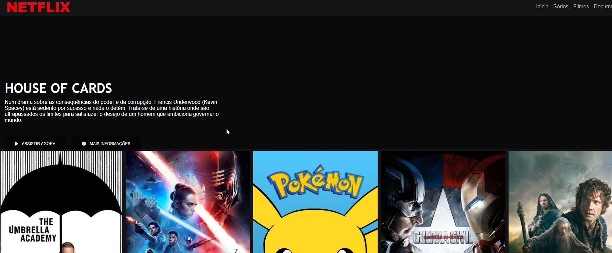

# 🕹 DIO - Aula Clone Netflix
> Aula da DIO - Construindo página Clone da Netflix

## 📋 Índice
- [Link do projeto:](https://finandolopes.github.io/clone-netflix/)

- [📖 Sobre](#-Sobre)
- [🚀 Tecnologias utilizadas](#-Tecnologias-utilizadas)
- [🖥 Preview](#-Preview)

## 📖 Sobre
 - Aula da DIO - CConstruindo página Clone da Netflix

## 🚀 Tecnologias utilizadas
- `HTML`
- `JAVASCRIPT`
- `CSS`

## 🖥 Preview:

  

   

